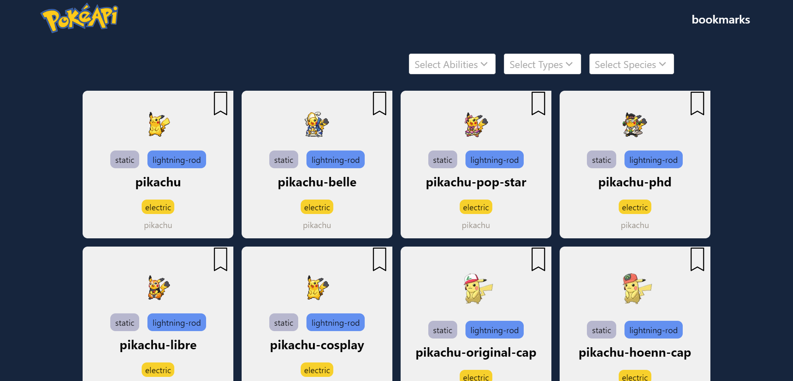
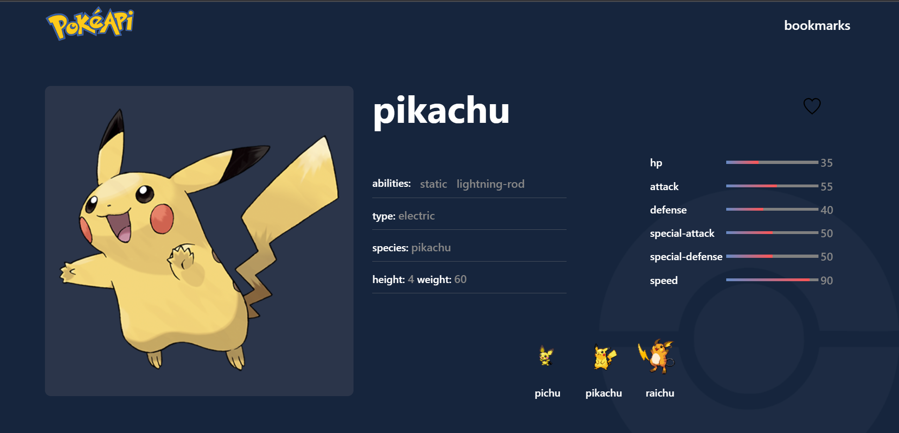

# Pokédex

Pokédex is a web application built using ReactJS that allows users to search and explore information about Pokémon using the PokéAPI.

## Live Demo

A live demo of the application is available at [https://pokedexassign.netlify.app/](https://pokedexassign.netlify.app/)

## Features

- Search Page: Allows users to search for Pokémon by name and displays loading indicators while fetching data from the API.
- Listing Page: Shows a grid of Pokémon images and names in an infinite scrollable format, with the ability to load more Pokémon as the user scrolls. Includes options to filter the results by abilities, characteristics, group, habitat, location, and species.
- Details Page: Provides detailed information about a selected Pokémon, including attributes obtained from the API. Users can bookmark or unbookmark Pokémon as favorites.
- Bookmarks Screen: Displays a list of bookmarked Pokémon that are saved locally on the device. Allows users to remove Pokémon from bookmarks.

## Screenshots

<!-- Add screenshots of your application here -->

